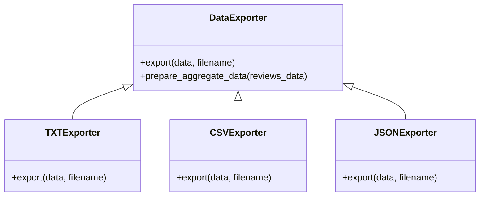

# AE2 Assessment - Task Completion & Evidence

## Student Details
**Name:** Beniamin-Cristian Capra
**Student ID:** [20022781]

## Task Completion Table

| Task | Description | Status |
|------|-------------|--------|
| **Section A** | | |
| 1 | Display welcome message | Completed |
| 2 | Read data from CSV file | Completed |
| 3 | Main menu implementation | Completed |
| 4 | Input validation | Completed |
| 5 | Continuous program loop | Completed |
| 6 | Sub-menu system | Completed |
| **Section B** | | |
| 7 | Display all reviews for a park | Completed |
| 8 | Count reviews by park and location | Completed |
| 9 | Average rating by park and year | Completed |
| **Section C** | | |
| 10 | Pie chart: Reviews per park | Completed |
| 11 | Bar chart: Top 10 locations by rating | Completed |
| 12 | Bar chart: Monthly average ratings | Completed |
| **Section D** | | |
| 13 | Average score per park by location | Completed |
| 14 | OOP Export Data feature (TXT, CSV, JSON) | Completed |

## GitHub Evidence

### Recent Commits

## PEP 8 Compliance

**Status:** Code has been checked against PEP 8 standards.
![

### Class Diagram

### Explanation
The export functionality uses a base class `DataExporter` which defines the interface. Specific export formats are implemented in subclasses (`TXTExporter`, `CSVExporter`, `JSONExporter`) which override the `export` method. This demonstrates polymorphism and inheritance.

